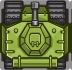
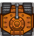
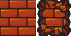

# Сценарий игры <!-- omit in toc -->

Игрок управляет танком, который двигается влево, вправо, вверх, вниз по карте, а так же может стрелять.
Цель игры уничтожить все вражеские танки.

В начале каждого уровня вражеские танки, разбросанные по уровню охотятся на игрока и стреляют, стараются объезжать 
препядствия расположенные на карте.

Описание объектов:

|                Объект                 | Описание                                        |
|:-------------------------------------:|:------------------------------------------------|
|            | Модель танка игрока.                            |
|            | Модель вражеского танка.                        |
|  | Модель кирпичной стены, разрушаемый объект.    |
|  | Модель стальной стены, не может быть разрушена. |
|              | Модель леса, танк проезжает сквозь.             |
